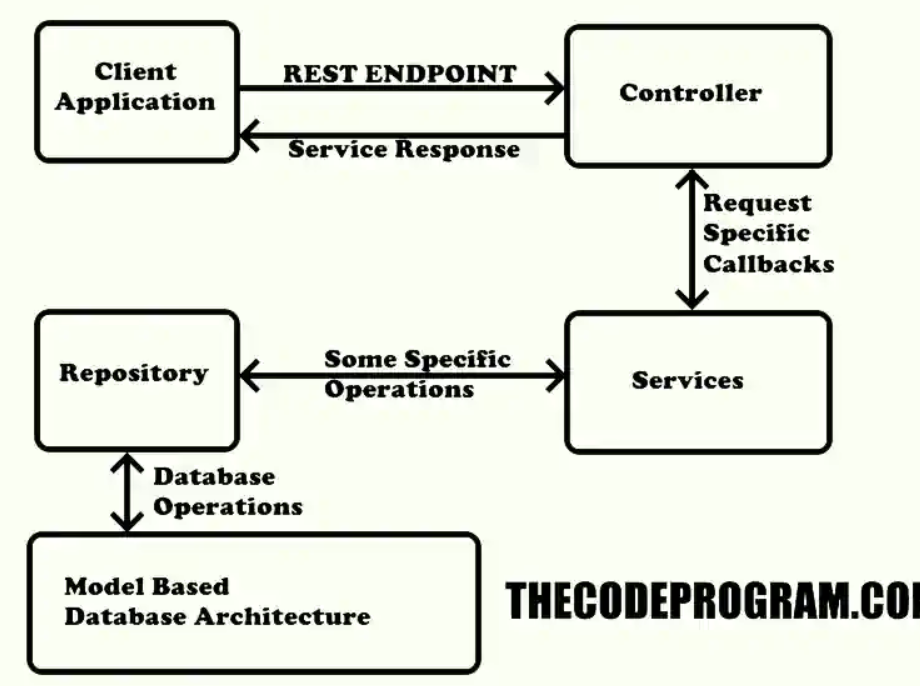

# :triangular_flag_on_post: Spring

**Spring** aslında komple bir frameworktür. Basit uygulamalardan kapsamlı uygulamalara kadar geliştirme yapmanıza imkan tanır. POJO tabanlı modeli ile geliştiricilere kolaylık sağlar.

Yapısında Inversion of Control (IoC) de bulunan **Spring** nesnelerin oluşturulması, kodun yaşam döngüsü, nesneler arası bağımlılıklar gibi bir çok olayın yönetimini yazılım geliştiriciden alıp, Spring’e verir.

**Spring**’in sahip olduğu IoC’nin en önemli parçalarından birisi, yazdığınız sınıfları ve bunların bağımlılıklarını sizin için yöneten bir bağımlılık enjeksiyonuna (Dependency Injection) sahip olmasıdır. Bağımlılık enjeksiyonu ile nesneler arasındaki bağlar XML yapılandırma dosyaları ile otomatik olarak gerçekleşir. Bu da aslında bağımlılıkları ortadan kaldırır.

Spring platformunda yer alan Spring Boot, Spring Data, Spring MVC, Spring Batch, Spring Security gibi projelerin temelinde Spring framework yer alır.

Spring framework temelinde ise Spring Core modülünde yer alan IoC Container vardır.


## 🎯 Spring Bean Yaşam Döngüsü

Spring framework'ün bir parçası olarak, Spring beanlerinin yaşam döngüsü belirli bir sıraya göre gerçekleşir. Bu sıra, Spring konteyneri tarafından yönetilir ve bir bean'in oluşturulması, konfigürasyonu, kullanıma hazır hale getirilmesi, kullanımı ve son olarak imha edilmesi aşamalarını kapsar. Bu işlemler sırasıyla şöyle gerçekleşir:

1. **Bean Oluşturma (Instantiation):** Spring container, bean sınıfının bir örneğini oluşturur. Bu, genellikle Java'nın nesne oluşturma işlemi ile gerçekleştirilir. Bean oluşturma işlemi, ya doğrudan bir sınıfın örneği oluşturularak ya da bir fabrika metodu aracılığıyla gerçekleştirilebilir.
2. **Bağımlılıkların Enjekte Edilmesi (Dependency Injection):** Spring container, oluşturulan bean örneği için gerekli olan tüm bağımlılıkların enjekte edilmesini sağlar. Bu, constructor injection, setter injection veya field injection gibi yöntemlerle gerçekleştirilebilir.
3. **Bean'in Konfigürasyonu (Bean Configuration):** Spring container, bean örneğini ve bağımlılıklarını yapılandırır. Bu işlem, bean'in durumunu belirleyen özelliklerin ayarlanmasını ve özelleştirilmesini içerebilir.
4. **Bean'in Hazır Hale Getirilmesi (Bean Post Processing):** Spring container, bean örneğini işleyebilecek ek işlemler gerçekleştirebilir. Bu, bean örneğinin kendisinde veya bağımlılıklarında belirli değişiklikler yapmak için kullanışlı bir noktadır. Örneğin, bean'in özel bir annotation'ı işlenebilir.
5. **Bean'in Kullanıma Hazır Hale Getirilmesi (Initialization):** Spring container, bean örneğini kullanıma hazır hale getirir. Bu, bean'in init metodu gibi özel bir yöntem aracılığıyla gerçekleştirilir.
6. **Bean Kullanımı (Bean Usage):** Spring container, bean örneğini uygulama içinde kullanır.
7. **Bean İmhası (Bean Destruction):** Spring container, artık kullanılmayan bean örneğini imha eder. Bu, bean'in destroy metodu gibi özel bir yöntem aracılığıyla gerçekleştirilir.

Bu adımlar, Spring container'ın yönettiği her bean için tekrarlanır ve böylece Spring beanlerinin yaşam döngüsü tamamlanmış olur.

# 🎯 IoC ve Dependency Injection Nedir?

## :pushpin: **Inversion of control (IoC)**

Yazdığımız kod bloğu çalışacağı zaman, framework bizim kodumuzu çağırır ve çalıştırır daha sonra kontrol yeniden framework’e geçmesi olayının tümüne **Inversion Of Control** adı verilmektedir.

IoC prensibi, sınıfların veya bileşenlerin birbirleriyle sıkıca bağlı olduğu, sıkı kenetlenmiş kod yapılarından kaçınmak için kullanılır. Bu prensip sayesinde, yazılım bileşenleri birbirinden daha bağımsız hale gelir ve yeniden kullanılabilirlik, test edilebilirlik, bakım kolaylığı gibi avantajlar elde edilir.

IoC prensibi, genellikle bir "konteyner" veya "enjektör" olarak adlandırılan bir ara katman kullanılarak uygulanır. Bu ara katman, bileşenlerin oluşturulması, yapılandırılması ve yönetilmesi gibi işlevleri üstlenir. Bu sayede, bileşenler arasındaki bağımlılıklar azaltılır ve sistem daha esnek hale gelir.


### Inversion of Control’ün getirdiği avantajlar;

1. Bir methodun implementasyonundan izole bir şekilde çalıştırılabilmesini sağlar.
2. Farklı implementasyonlar arasında, kolayca geçiş yapabilmenizi sağlar.
3. Program modülerliğini artırır.
4. Bağımlılıklar en aza indiği için test etmeyi/yazmayı kolaylaştırır.


## :pushpin: **Dependency Injection**

Dependency injection kaba tabir ile bir sınıfın/nesnenin bağımlılıklardan kurtulmasını amaçlayan ve o nesneyi olabildiğince bağımsızlaştıran bir programlama tekniği/prensibidir.

Dependency Injection tekniğinde bağımlılık oluşturacak parçalarının ayrılıp, bunların sisteme dışarıdan verilmesi (enjekte edilmesi) ile meydana gelir.

**Spring Framework kullanarak Dependency Injection sağlamanın 3 farklı yolu var.**

**1. Constructor ile Dependency Injection**

Örneğin bir servis sınıfımız olsun ve bu servis sınıfımızın bağımlı olduğu bazı repository’leri ya da farklı servisleri olsun. Eğer constructor ile Dependency Injection yapmayı planlıyorsak bunu değişkenlerimizin access modifier’larını private final olarak tanımlayarak yapabiliriz.

```java
public class ProductService {

private final ProductRepository productRepository;
private final CompanyService companyService;

public UserService(ProductRepository productRepository, CompanyService companyService) {
this.productRepository= productRepository;
this.companyService= companyService;
} }
```
**2. Setter ile Dependency Injection**

```java
public class ProductServiceImpl implements ProductService {
  private UserService userService;

  @Autowired
  public void setUserService(UserService userService) {
    this.userService = userService;
  }
}
```

**3. Field ile Dependency Injection**

<b>Field ile inject etme örneği de bu şekilde ancak bu yöntem önerilmemekte. Çünkü debug yapmak istediğiniz zaman burada ne değişken set edilirken ne döndüğünü görebileceğiniz bir debug point atma şansınızı kaybediyorsunuz. Bu nedenle constructor kullanımı öneriliyor.</b>

```java
public class AuthController {
  @Autowired
  private AuthenticationManager authenticationManager;
  @Autowired
  private JwtTokenUtil jwtTokenUtil;
  @Autowired
  private JwtUserDetailsService userDetailsService;
}
```


Dependency Injection Sayesinde;

- Gevşek bağımlılıklı, esnek uygulamalar oluşturabiliriz.(Loosely Coupled)
- Uygulama içerisinde değişmesi, müdahale edilmesi gereken yerleri minimum’a indirir. (Böylece sayfalarca refactoring etmek zorunda kalmazsınız.)
- Test edilebilirliği destekler.


# 🎯 **Springboot nedir?**

Springboot Java programlama dilinde geliştirilen ve Java dilinde güçlü MicroService yazılmasına olanak tanıyan bir frameworktür. Springboot sayesinde backend uygulama geliştirirken veritabanı işlemlerimizi Java ile Language Integrated olarak yazabiliriz ve Springboot tarafından bu işlemler gerçekleştirilir. Aynı zamanda client tarafındaki uygulamalar içinde servis uçları sağlayarak veri girdi-çıktısı oluşturabiliriz.

### :pushpin: **Springboot nasıl çalışır?**

Bir SpringBoot uygulamasının çalışması için 3 temel anotasyon bulunmaktadır :

- **@SpringBootApplication**
- **@EnableAutoConfiguration**
- **@ComponentScan**

**@SpringBootApplication** anotasyonu uygulamanın giriş metodunu belirtir. Yani halk arasındaki tabir ile main fonksiyondur. Uygulama bu metod ile başlar.

**@EnableAutoConfiguration** anotasyonu ile uygulama bağlılıkları (dependencies) içerisinde belirtilen yapılandırmaları otomatik olarak çalıştırır. Örnek olarak veritabanı ayarlamasını yapar, REST yapılandırmasını hazırlar ve gerekli olan herşey uygulama için hazır hale gelir.

**@ComponentScan** anotasyonu ise proje içerisinde tanımlanan bütün komponentleri tarar. Bu sayede modeller, repositoryler servisler, controllerlar vs. hepsi kullanıma hazır hale getirilir.


### 🎯 **Sprinboot uygulama katmanlarınndan bahsedelim**

Genel olarak temel bir springboot uygulamasında aşağıdaki işlem katmanları bulunur. Düzenli geliştirme yapabilmek adına işlemlerin ilgili katmandan yapılması önemlidir. Aksi hale büyük projelerde karmaşıklıklar oluşma ihtimali yüksektir.
<b>
- Model Katmanı : Model katmanında veritabanı tablolarımızın modelleri hazırlanır ve yapılandırmalar belirlenir.
- Repository katmanı : Uygulamanın veritabanı ile kuracağı iletişim Repository katmanı üzerinden sağlanır.
- Service Katmanı : Uygulamanın gerçekleştireceği özel işlemler ve kontroller servis katmanında belirlenir.
- Controller Katmanı : Oluşturulan REST servis uçları controller katmanı tarafından belirlenir ve servis ile iletişim controllerlar üzerinnden kurulur. </b>




## :pushpin: Spring vs Spring Boot

- Spring boot spring çatısının daha kolaylaştırılmış halidir.
- Spring ile çalışacaksan bir web sunucu üzerinde çalışman gerekir (web uygulamaları için söylüyorum) spring boot ise hazırda içine eklenmiş sunucu ile geliyor. Yani ek olarak kurman gerekmiyor.
- Spring boot starter paketleriyle beraber proje tipine göre hazır kütüphaneler eklenmiş olarak gelir. Spring ile çalışırken core, security, web, data taraflarını kendiniz eklemeniz gerekir.
- Bağımsız uygulamalar yaratmanızı sağlar.
- Tomcat, Jetty, Undertow direkt gömülü olarak gelir (bunların war dosyalarını deploy etmeye gerek yoktur.)
- Maven yapılandırmasını kolaylaştırmak için başlangıç POM’larını sağlar.
- Mümkün oldukça otomatik olarak Spring’i yapılandırır.
- XML yapılandırması için kesinlikle hiçbir kod yaratma ve gereksinim yoktur.
- Spring bağımlılıklarını kolaylaştırır, versiyon çakışmalarını önler.
- Bir uygulama konteynır olmadan komut satırından direkt olarak çalıştırılabilir.


...
...
...


